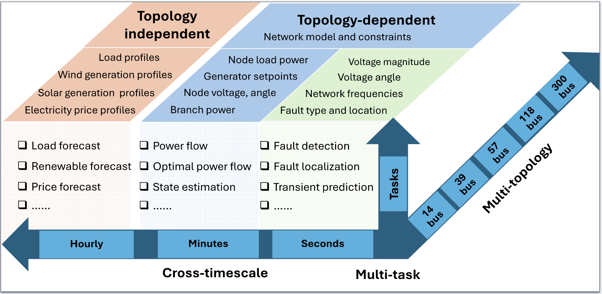
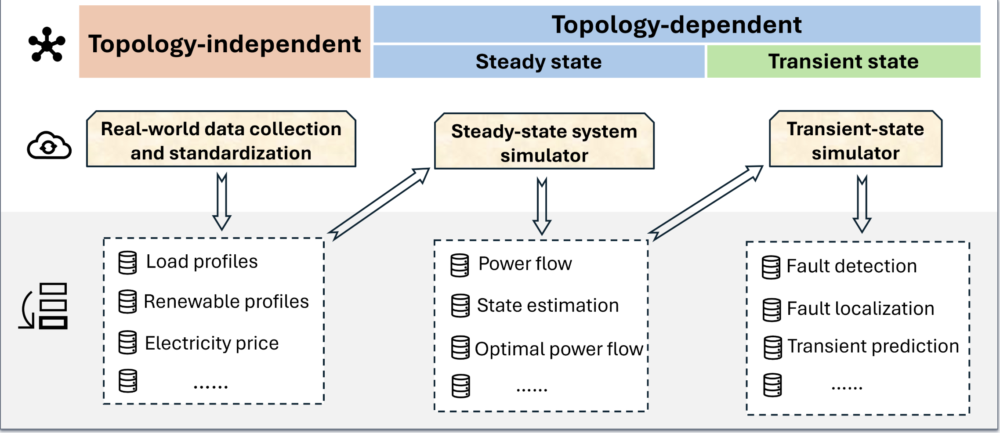

# OpenPowerBench: Dataset and Benchmark for Power System Foundation Models Across Multiple Scales and Topologies

---


## Introduction

OpenPowerBench is a first-of-its-kind open-source, multi-task, cross-temporal dataset designed to support training and evaluation of foundation models in power systems. OpenPowerBench includes both topology-dependent tasks (e.g., power flow, optimal power flow, contingency analysis) and topology-independent tasks (e.g., load forecasting, price prediction), supported by a modular data generation pipeline for scalable benchmarking across synthetic and real-world scenarios.

<p align="center">

</p>

<p align="center">

</p>

## Datasets
You can access the OpenPowerBench datasets from [[Havard Dataverse]](https://doi.org/10.7910/DVN/JGLYFM)

---
## Quick Demos
### Topology-independent
1. Clone the repo
```
git clone https://github.com/OpenPowerBench/OpenPowerBench
cd topology_independent
```
2. To install all dependencies:
```
pip install -r requirements.txt
```
3. Download datasets and place them under `./data`, organized by task. Preprocess training dataset with:
```
python training_dataset_process.py
```
4. We provide experiment configs for baseline models training in folder './configs'. For example, you can train and evaluate load forecasting by:

LSTM:
```
python run_model.py --config configs/lstm.yaml --task load --epochs 10
```

Transformer:
```
python run_model.py --config configs/transformer.yaml --task load --epochs 50
```

Time-LLM:
```
python run_timellm.py --config configs/timellm.yaml
```
---

## Evaluation Metrics

### Topology-independent

---
During training we log:

* **NRMSE** (%)
* **R²**
Custom metrics can be added in `topology_independent/utils/metrics.py`.
---

## Acknowledgement

Our implementation of **Time-LLM** is adapted from the authors’ official release:
> Jin M., Wang S., Ma L., Chu Z., Zhang J. Y., Shi X., Chen P-Y., Liang Y., Li Y-F., Pan S., & Wen Q. (2024). Time-LLM: Time Series Forecasting by Reprogramming Large Language Models. Proceedings of the International Conference on Learning Representations (ICLR 2024). Code: https://github.com/KimMeen/Time-LLM (commit 02ee1b8).

If you build on this component, please cite the original paper:

```bibtex
@inproceedings{jin2023time,
  title={{Time-LLM}: Time series forecasting by reprogramming large language models},
  author={Jin, Ming and Wang, Shiyu and Ma, Lintao and Chu, Zhixuan and Zhang, James Y and Shi, Xiaoming and Chen, Pin-Yu and Liang, Yuxuan and Li, Yuan-Fang and Pan, Shirui and Wen, Qingsong},
  booktitle={International Conference on Learning Representations (ICLR)},
  year={2024}
}
